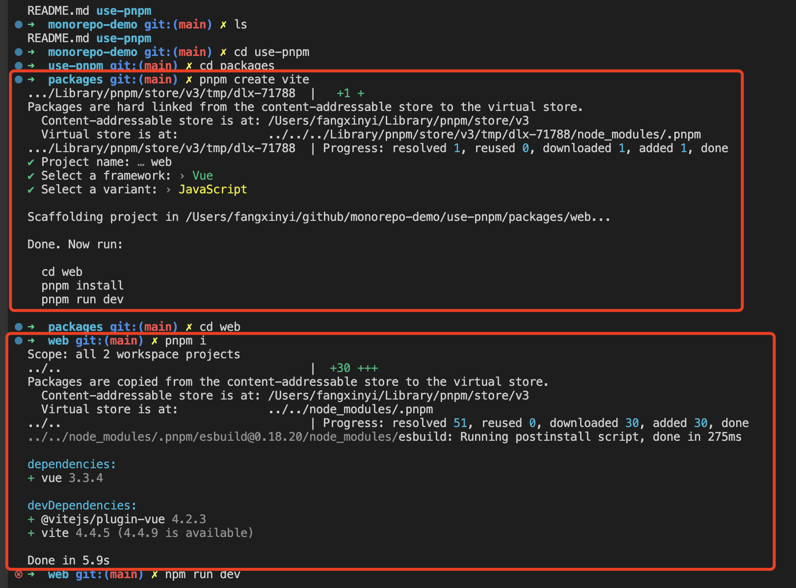
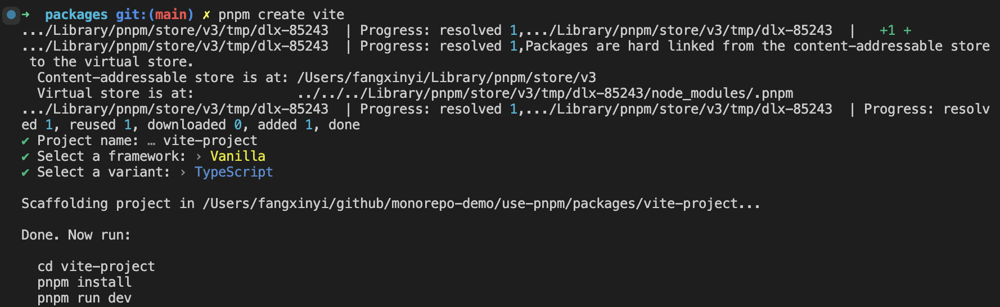
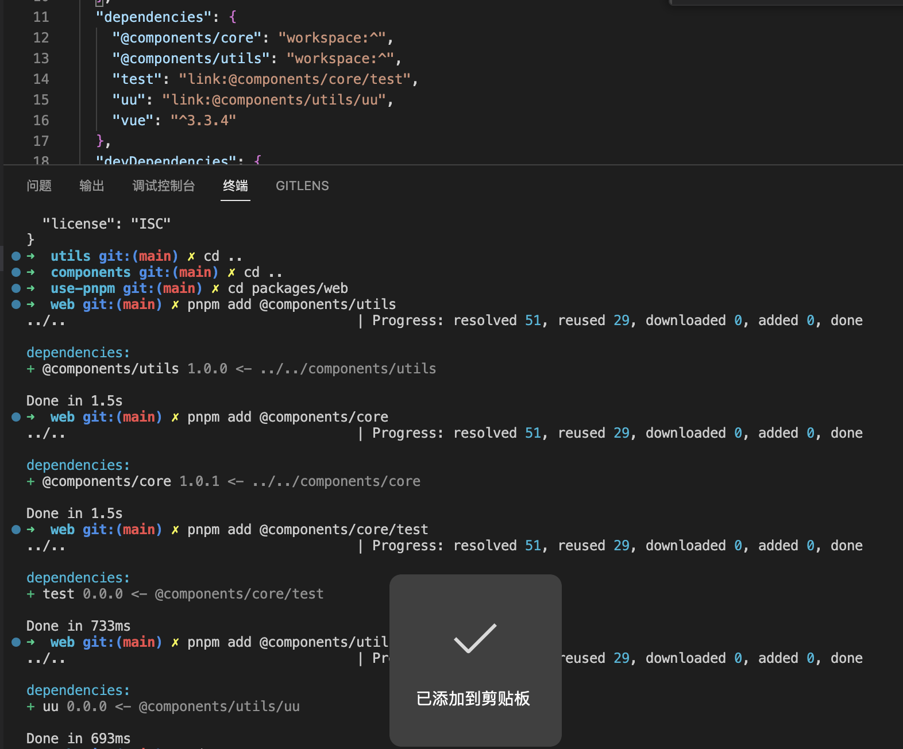

问题总结


# 1、/store/v3/tmp/xxx



第一个store/v3/tmp/dlx-71788/node_modules/.pnpm 是不是一个临时的全局位置？

在 `/Users/fangxinyi/Library/pnpm/store/v3/tmp` 目录中，pnpm 会存储一些临时文件，例如正在下载的包、解压缩的包等。这些临时文件在安装或更新包时会被使用，并在完成后被清理或移动到其他位置。

此外，pnpm 还会在该目录中缓存已下载的包，以便在后续的安装过程中可以直接使用缓存，而无需重新下载。这有助于提高包的安装速度，并减少网络流量。


# 2、postinstall

第二个，注意esbuild：Running postinstall script 

https://juejin.cn/post/7142397455597109279


# 3、pnpm add 某个包的截图

安装





# 4、pnpm-workspace.yaml

```yaml
packages:
  # all packages in direct subdirs of packages/
  - 'packages/*'
  # all packages in subdirs of components/
  - 'components/**'
  # exclude packages that are inside test directories
  - '!**/test/**'
```

```
- components
  - component1
  	- package.json
  	- component4
      - package.json
  - component2
    - package.json
  - component3
    - package.json
  - components1
    
```

当您在工作区的根目录中运行 `pnpm install` 命令时，pnpm 会自动识别 `components/**` 模式，并进入每个匹配的子目录执行包的安装。这意味着 `components1/components4` 目录中的 `package.json` 文件定义的依赖将被安装。

这里得自己试一试


# 5、pnpm add 对比npm install

在使用 `pnpm add` 命令安装包时，pnpm 会按照以下优先级顺序获取资源：

1. 本地缓存：pnpm 首先检查本地缓存，即位于 `~/.pnpm-store` 目录下的缓存。如果所需的包已经存在于缓存中，pnpm 将直接从缓存中获取资源，而无需重新下载。
2. 远程注册表：如果所需的包不在本地缓存中，pnpm 将尝试从远程注册表（如 npm registry）获取资源。它会向注册表发送请求，以获取包的元数据和可用版本信息。
3. 依赖树：如果包的依赖已经在项目的依赖树中存在，pnpm 将直接从依赖树中获取资源。这意味着如果项目中的其他依赖已经安装了所需的包，pnpm 将重用这些已安装的依赖，而不是重新下载。
4. 远程源码：如果以上步骤都无法获取资源，pnpm 将尝试从远程源码获取资源。它会从包的源代码仓库（如 GitHub）下载源代码，并根据需要进行构建和安装。

总的来说，pnpm 在安装包时会优先使用本地缓存和已安装的依赖，以提高安装速度和节省网络流量。只有当所需的包不在本地缓存或依赖树中时，pnpm 才会从远程注册表或远程源码获取资源。这种优先级顺序可以帮助提高包的安装效率，并减少对网络的依赖。


# 6、link

```json
"dependencies": {
    "@components/core": "workspace:^",
    "@components/utils": "workspace:^",
    "test": "link:@components/core/test",
    "uu": "link:@components/utils/uu",
    "vue": "^3.3.4"
  },
```

这个link是什么意思

在上述代码中，"test": "link:@components/core/test" 中的 "link" 是指使用符号链接（symbolic link）的方式来引用依赖。

当使用 "link" 作为依赖的安装方式时，它会创建一个符号链接，将依赖包链接到当前项目中。这意味着，当您在项目中引用 "test" 依赖时，实际上会使用 "@components/core/test" 的代码和文件，而不是从外部依赖中复制一份。

这种方式常用于开发过程中，当您正在开发一个依赖包，并希望在项目中实时使用最新的代码时，可以使用符号链接来引用依赖。这样，对依赖包的修改会立即反映在项目中，无需手动进行复制或重新安装。

需要注意的是，使用符号链接方式引用依赖需要确保依赖包已经被正确地链接到项目中。通常，您需要在依赖包的根目录中运行 `npm link` 或 `pnpm link` 命令，将依赖包链接到全局或本地的包管理器中。然后，在项目中使用 "link" 形式的依赖声明，以确保正确引用依赖。

总结起来，"link:@components/core/test" 表示使用符号链接的方式引用 "@components/core/test" 依赖包，使项目中的 "test" 依赖直接指向该依赖包的代码和文件。